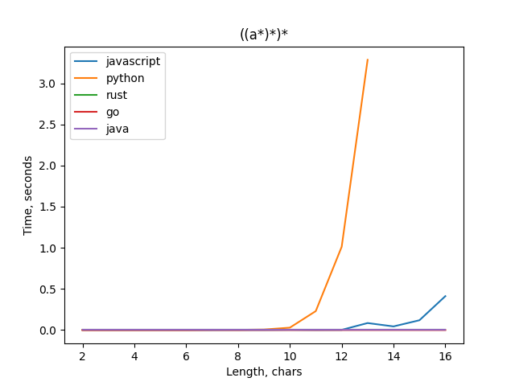

# Regex Matcher

## Installing
1. Set the environment variable `REGEX_MATCHER_ROOT=../regex_matcher`
2. Set configuration `perl configure`
3. Run `pip install -r requirements.txt`

## Matching
```
python main.py filename.json
```

filename.json
```
{
    "languages": List[str] | "" | str, // if "" then all machines are used
    "target_file": str, // optipnal
    "regex": str,
    "word": str,
    "attack_group": {   // optional 
        "prefix": str,
        "pump": str,
        "suffix": str,
        "limit": int (max iteration of pumping)
    }
    "visual_file": str, // optional for dependency visualization
}
```

## Example
```
python main.py test/test.json
```
<p align="center">
    
</p>