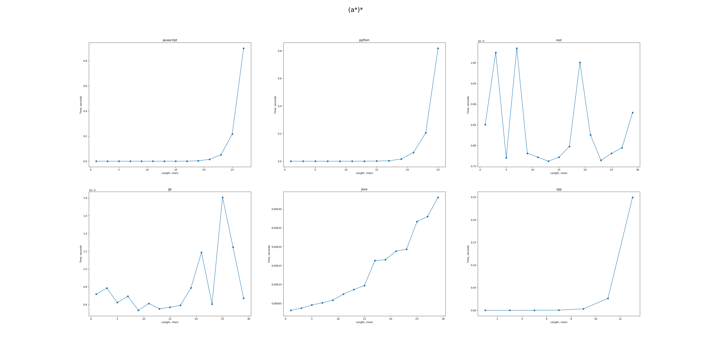

# Regex Matcher
Matching regular expressions with words or groups of pumping words in Java, Python, Javascript, C++, Go, Rust and measuring time consuming.

## Installing
1. Install packages
```
sudo apt-get install make default-jdk maven nodejs cargo golang-go python3-pip g++
```
2. Set the environment variable `export REGEX_MATCHER_ROOT={path}/regex_matcher`
3. Configure files
```
# go
cd $REGEX_MATCHER_ROOT/src/go
make

# java
cd $REGEX_MATCHER_ROOT/src/java
mvn clean compile; mvn clean package

# rust
cd $REGEX_MATCHER_ROOT/src/rust
make

# c++
cd $REGEX_MATCHER_ROOT/src/cpp
make
```
3. Install requirements `pip install -r requirements.txt`

## Matching
```
usage: main.py [-h] [-v VISUALIZE] [-m] filename

positional arguments:
  filename              path to json file for matching 
                        {
                            'regex': str, (target_file regex), 
                            'word': str, (optional, input to match),
                            'pump': Dict[str, Any], (optional, dictionary of the format:
                            {
                                'attack': List[List[str]|str], (e.g. [["a", "1"], "b", ["a", "1"]])
                                'steps': Dict[str, List[int]], (e.g. {"1": [start, end, step]}, [start, end))
                            }),
                            'languages': List[str], (optional, languages to use, None means all),
                            'target_file': str, (optional, file to save matching results),
                            'encoding': str, (optional, global encoding, defaults to 'utf-8')
                        }

options:
  -h, --help            show this help message and exit
  -v VISUALIZE, --visualize VISUALIZE
                        path to file for dependency visualization
  -m, --multiplot       whether to plot several dependency images
```

## Example
```
python3 main.py test/test.json -v test/visual.png -m
```
<p align="center">
    
</p>